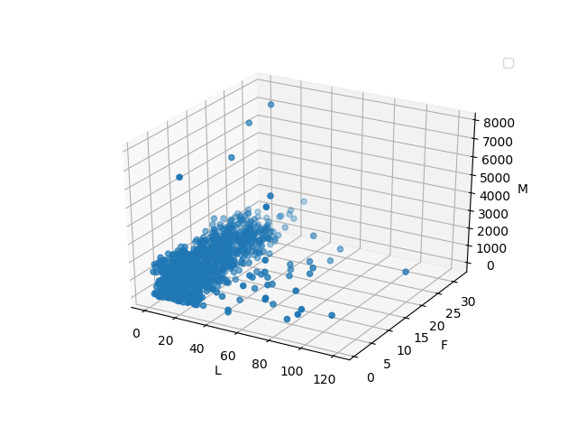
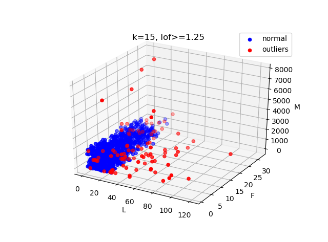
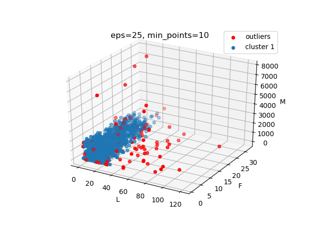
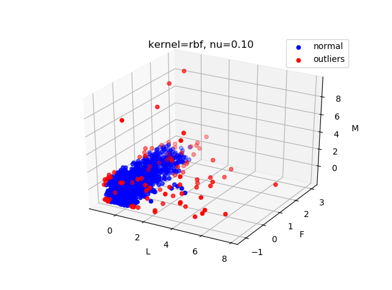

# Outlier Detection


[](https://python.org)
[](http://www.apache.org/licenses/)

Detect outliers with 3 methods including local outlier factor, DBSCAN and SVDD.

## Prerequisites

* Required packages can be installed with the following command:
```
pip install -r requirements.txt
```

## Data

* `consumption_data.xls` is provided. There are 940 3-dimentional entries. The first column is entry ID.
* Get numpy array data with size `[940, 3]` with the following code (check out `dataset.py` for implementation):

```python
from dataset import get_dataset

data = get_dataset()
```

* Data visualization:


## Methods

For detailed descriptions please see `report.pdf`.

### Density based method: LOF

* LOF: local outlier factor
* Check out `lof.py` for implementation.
* Result:


### Cluster based method: DBSCAN

* Check out `dbscan.py` for implementation.
* Result:


### Classification based method: SVDD

* SVDD: one class SVM clssification
* Check out `svdd.py` for implementation.
* Result with Gaussian kernel:

* Result with linear kernel:


## Author

Zhongyu Chen
